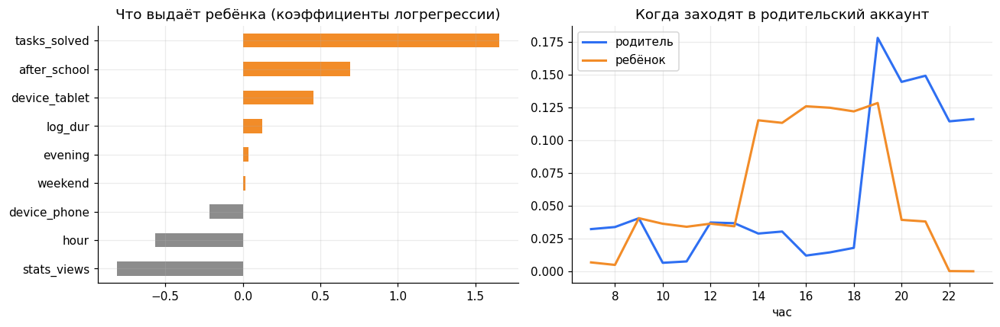
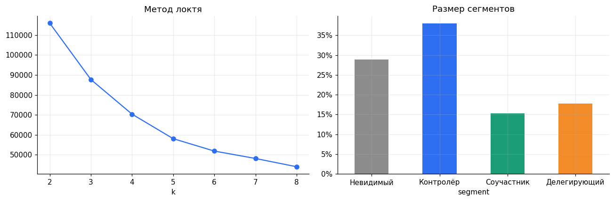
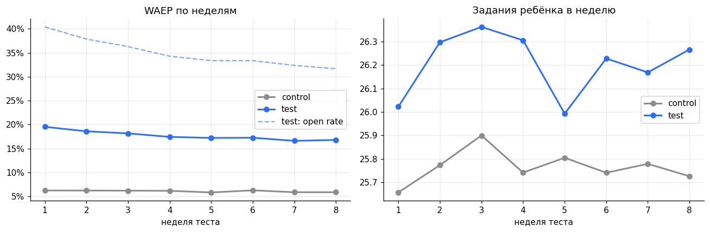
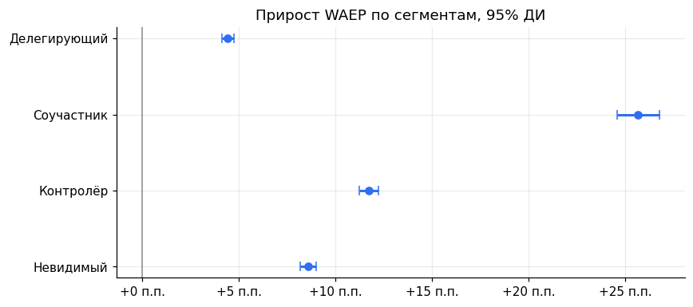

# Родитель на Учи.ру: из наблюдателя — в участника

Продуктовое discovery-исследование родителя на платформе Учи.ру, мини-сервис «Семейный пульс», работающий прототип и система метрик вовлечения. Проект по задаче VK.

**Что внутри**

| Папка | Что там |
|---|---|
| [`notebooks/uchi_parent_discovery.ipynb`](notebooks/uchi_parent_discovery.ipynb) | Вся количественная часть: классификатор «кто в аккаунте», сегментация, дерево метрик, A/B-тест с CUPED и IV-оценкой, экономика |
| [`prototype/family_pulse.html`](prototype/family_pulse.html) | Кликабельный прототип. Открывается в любом браузере, без сборки |
| [`data/`](data/) | Датасет: семьи, сессии до теста, недельная панель, итог теста |
| [`img/`](img/) | Графики из ноутбука |

---

## Коротко

Родителей на Учи.ру 6,2 млн, учеников — больше 15 млн, из них около 10 млн активны каждый месяц. Родитель платит и мог бы влиять на учёбу, но в продукте его почти нет.

Что выяснилось:

- **58% входов в родительский аккаунт делает ребёнок**, по времени — 82%. Метрика «активные родители» по логинам завышена в разы.
- Родители делятся на четыре поведенческих сегмента. Две трети — Невидимые и Контролёры: заходят редко или только смотрят цифры и ничего не делают.
- Им не хватает не данных, а **повода и простого действия**.

Что предлагаем: **«Семейный пульс»** — воскресный дайджест на три минуты с PIN-входом родителя и одним действием в один тап: похвалить, сделать 10-минутное задание вместе, поставить цель на неделю. Если ребёнок упирался в бесплатный лимит, дайджест объясняет это и предлагает пробный период.

Что показал A/B-тест на 40 000 семей за 8 недель:

| Метрика | Контроль | Тест | Эффект |
|---|---|---|---|
| **WAEP** (North Star) | 6,1% | 17,7% | +11,6 п.п., p < 0,001 |
| Вовлечён ≥3 из 4 последних недель | 0,9% | 7,0% | ×7,8 |
| Задания ребёнка в неделю (CUPED) | 25,8 | 26,2 | +1,7%, p < 0,001 |
| Активные дни ребёнка в неделю | 3,53 | 3,56 | +0,7%, p = 0,049 |
| Конверсия в подписку за 8 недель | 2,2% | 3,0% | +0,7 п.п., p < 0,001 |
| Сессии ребёнка в аккаунте родителя | 0,99 | 0,72 | −28% |
| Отписки от дайджеста | — | 9,3% | порог 10% |

Решение: раскатывать на всех, держать под контролем отписки. Следующий тест — отдельный сценарий для «Делегирующих».

---

## 1. Контекст и постановка

| Факт | Значение | Источник |
|---|---|---|
| Ученики | 15+ млн, ~10 млн MAU | [VK, 01.09.2026](https://vk.company/ru/press/releases/12400/) |
| Родители | 6,2 млн | там же |
| Учителя | 909 тыс. | там же |
| Бесплатный доступ | 20 заданий в день после 16:00 и в выходные, без ограничений на уроке у учителя | [описание тарифов](https://fivepost.ru/promokodi/uchi/) |
| Подписка | 290–790 ₽ в месяц, 3 000–5 000 ₽ в год | там же |
| Что видит родитель сейчас | прогресс по предметам, время занятий, олимпиады | [Сравни.ру](https://www.sravni.ru/enciklopediya/info/lichnyj-kabinet-uchiru/) |
| Как родители помогают с уроками | 37% изредка, 28% регулярно вместе, 16% только проверяют, 13% глубоко погружаются, 6% не вмешиваются | [Rambler&Co, 2024, n=18 800](https://www.sostav.ru/blogs/260202/45469) |
| Типы вовлечённости | пять типов: от «компетентных помогающих» до «невовлечённых» | [НИУ ВШЭ, 2022, n=14 337](https://skillbox.ru/media/education/roditeley-razdelili-po-tipam-vovlechyennosti-v-shkolnoe-obrazovanie-detey/) |

Текущий кабинет родителя отвечает на вопрос «что происходит». Он не отвечает на вопрос «что мне с этим делать». Родитель смотрит на график, закрывает приложение, а в следующий раз приходит, когда ребёнок упёрся в лимит и просит купить подписку.

**Цель исследования.** Понять, кто такой родитель на платформе и какую работу он хочет сделать, придумать мини-сервис, который превратит его в участника, и доказать метриками, что вовлечение можно измерить и сдвинуть.

### Гипотезы

| # | Гипотеза | Как проверяли | Итог |
|---|---|---|---|
| H1 | Значительная часть сессий в родительском аккаунте — ребёнок | Классификатор сессий, обученный на пилоте PIN-входа | Подтвердилась: 58% сессий |
| H2 | Родители неоднородны, сегменты требуют разных сценариев | K-means по поведению до теста | Подтвердилась: 4 сегмента |
| H3 | Еженедельный ритуал с одним действием поднимет долю действующих родителей | A/B-тест, WAEP | Подтвердилась: ×2,9 |
| H4 | Действие родителя сдвигает учёбу ребёнка | A/B + IV-оценка | Подтвердилась, эффект небольшой |
| H5 | Объяснение лимита в контексте конвертирует лучше пейвола | Сравнение внутри тестовой группы | Подтвердилась, ~2× (наблюдательно) |

---

## 2. Кто сидит в родительском аккаунте



Логистическая регрессия на признаках сессии: час, длительность, решённые задания, просмотры статистики, устройство. ROC-AUC 0,93 на отложенной выборке.

Ребёнка выдают решённые задания и время после школы (14:00–19:00). Родитель заходит вечером, с 19:00, на пару минут и смотрит статистику.

**Вывод.** Если не разделить родителя и ребёнка на входе, любая метрика вовлечения родителя будет шумом. Поэтому первый экран «Семейного пульса» — «Кто открывает?» и PIN для родителя.

## 3. Сегменты и работы (JTBD)



| Сегмент | Доля | Поведение | Работа, ради которой он «нанимает» продукт | Что ему даём |
|---|---|---|---|---|
| **Невидимый** | ~29% | Почти не заходит, ребёнок занимается мало | «Когда нет времени разбираться, хочу за минуту понять, всё ли в порядке» | Короткий дайджест: одна цифра и одно дело |
| **Контролёр** | ~38% | Заходит вечером, смотрит статистику, ничего не делает | «Хочу узнать, где проседает, до того как придёт двойка» | «Трудно: …» и готовое 10-минутное задание по этой теме |
| **Соучастник** | ~15% | Часто заходит, хвалит, ставит цели | «Хочу заниматься вместе и не превращать это в войну» | Цели, совместные задания, похвала |
| **Делегирующий** | ~18% | Отдал аккаунт ребёнку: 86% сессий — ребёнок | «Хочу, чтобы ребёнок занимался сам и меня не дёргал» | Отдельный вход ребёнка, отчёт без действий |

Сегменты сходятся с типологией ВШЭ: «контролирующие», «поддерживающие автономию», «вовлечённые помогающие», «невовлечённые».

### Путь родителя сейчас

1. Учитель на собрании даёт код — родитель регистрируется.
2. Пару раз смотрит статистику.
3. Забывает. Ребёнок заходит через родительский аккаунт с его телефона.
4. Ребёнок упирается в лимит 20 заданий и просит «купить Учи.ру».
5. Родитель видит пейвол без объяснения, зачем платить, — закрывает или покупает под давлением.

Главные разрывы: нет повода вернуться (шаг 3), родитель и ребёнок перепутаны (шаг 3), лимит без контекста (шаг 5).

## 4. Решение: «Семейный пульс»

**Прототип:** [`prototype/family_pulse.html`](prototype/family_pulse.html) — откройте файл в браузере. Справа от телефона — журнал событий и воронка недели: видно, как каждое нажатие попадает в трекинг и засчитывается ли семья в WAEP.

### Сценарий

1. **Воскресенье, 20:00** — push «Итоги недели Маши готовы». Время выбрано по пику родительских входов (19:00–21:00).
2. **«Кто открывает?»** — родитель вводит PIN, ребёнок уходит в своё приложение.
3. **Неделя в трёх фактах**: сколько заданий и как это соотносится с прошлой неделей; что получается; где трудно.
4. **Одно дело на неделю**, каждое — в один-два тапа:
   - похвала — стикер, который ребёнок увидит при следующем входе;
   - задание на 10 минут вместе — бытовая задача на тему, где ребёнок буксует (время на часах, сдача в магазине, скидки);
   - цель — 3, 5 или 7 дней с занятиями.
5. **Если был лимит** — «Маша 4 раза упиралась в лимит», дни отмечены на графике, 7 дней без лимита бесплатно.
6. **Мягкий выход** — «присылать реже» раньше, чем «отписаться».

### Почему это, а не другое

Рассматривали пять идей и оценили по ICE (Impact, Confidence, Ease — от 1 до 10):

| Идея | I | C | E | ICE | Почему |
|---|---|---|---|---|---|
| **Воскресный дайджест с одним действием** | 8 | 7 | 8 | **448** | Родителю нужен повод и простое действие; дешево собрать на имеющихся данных |
| PIN-вход родителя | 6 | 9 | 9 | 486 | Нужен как фундамент, но сам по себе не вовлекает — вошёл в дайджест как первый шаг |
| Родительский чат с учителем | 7 | 4 | 3 | 84 | Нагрузка на учителей, модерация, конкуренция со школьными чатами |
| Геймификация для родителя (баллы, уровни) | 4 | 3 | 6 | 72 | Родителю не нужна ещё одна игра; риск раздражения |
| Полный курс «Как помогать с уроками» | 5 | 4 | 4 | 80 | Большая работа, невидимые родители не дойдут |

## 5. Метрики

### North Star Metric — WAEP

**Weekly Actively Engaged Parents** — доля родителей, которые за неделю сделали хотя бы одно действие для учёбы ребёнка: похвалили, поставили цель, выполнили совместное задание. Просмотр статистики не считается: это наблюдение, а не участие.

Почему именно она:

- отражает ценность для родителя (он что-то сделал) и для ребёнка (действие адресовано ему);
- считается чисто только после разделения родителя и ребёнка на входе;
- предсказывает то, ради чего всё затевается: учёбу ребёнка и выручку.

### Дерево

```
WAEP
├── Охват: дайджест доставлен (есть контакт и согласие)
├── Вход родителя: PIN, а не ребёнок
├── Open rate дайджеста
├── Конверсия в действие
│   ├── похвала
│   ├── совместное задание
│   └── цель на неделю
└── Удержание: WAEP ≥ 3 из 4 недель

Эффект на ребёнка:  задания в неделю, активные дни
Деньги:             конверсия в подписку, выручка на семью
Guardrails:         отписки < 10% за 8 недель, задания ребёнка не ниже контроля,
                    сессии ребёнка в аккаунте родителя не растут
```

### План трекинга

| Событие | Когда | Для какой метрики |
|---|---|---|
| `digest_delivered` | Дайджест ушёл | охват |
| `parent_mode_entered` | Верный PIN | чистота данных |
| `child_redirected` | На входе выбран «Я ученик» | guardrail |
| `digest_opened` | Открыт экран недели | open rate |
| `praise_sent` | Похвала ушла ребёнку | WAEP |
| `joint_task_done` | Совместное задание выполнено | WAEP |
| `goal_set` | Цель на неделю | WAEP |
| `limit_context_viewed` | Открыта карточка про лимит | монетизация |
| `trial_started` / `offer_dismissed` | Реакция на предложение | конверсия |
| `digest_frequency_changed` / `digest_unsubscribed` | Реже / отписка | guardrail |

Все события несут `family_segment` и `child_grade`, чтобы сразу резать эффект по сегментам.

## 6. A/B-тест

**Дизайн:** рандомизация по семье 50/50, 8 недель, 40 000 семей. Метрики усредняются по семье, сравнение средних по семьям (без псевдорепликации по неделям). SRM-проверка пройдена (p = 0,83). MDE для WAEP — 0,41 п.п., тест мощный с запасом. CUPED на данных за 4 недели до теста сузил доверительный интервал для заданий ребёнка на 61%.



Open rate дайджеста стартует с 40% и к восьмой неделе снижается до 32% — новизна уходит, но WAEP держится около 17%.

### Кому помогает сильнее



| Сегмент | WAEP контроль | WAEP тест | Прирост |
|---|---|---|---|
| Невидимый | 2,5% | 11,1% | +8,6 п.п. |
| Контролёр | 5,2% | 16,9% | +11,7 п.п. |
| Соучастник | 20,7% | 46,3% | +25,7 п.п. |
| Делегирующий | 1,2% | 5,6% | +4,4 п.п. |

Делегирующим дайджест почти не нужен. Им нужен отдельный вход ребёнка — это следующий эксперимент.

### Действие родителя → учёба ребёнка

Наивная корреляция в контроле говорит: семьи, где родитель действует каждую неделю, решают на 29 заданий больше. Это самоотбор: вовлечённые семьи и так учатся активнее. Честная IV-оценка через рандомизацию — **+3,8 задания в неделю**. Эффект есть, но в 8 раз меньше, чем кажется по корреляции.

### Контекст лимита против пейвола

Внутри тестовой группы, в неделях, когда ребёнок упирался в лимит:

| Что увидел родитель | Конверсия за неделю |
|---|---|
| Объяснение в дайджесте | 1,32% |
| Только стандартный пейвол | 0,68% |
| Ничего | 0,25% |

Сравнение наблюдательное, не рандомизированное. Чистую оценку даст отдельный тест с рандомизацией карточки лимита.

### Деньги

При раскатке на 60% родителей (есть контакт и согласие на рассылку), средний чек годовой подписки 4 000 ₽:

- дополнительно ~25 тыс. подписок за 8 недель;
- ~99 млн ₽ выручки, диапазон по 95% ДИ — 55–144 млн ₽.

Допущения — в ноутбуке, раздел 6.7, их легко поменять.

## 7. Риски и ограничения

- **Отписки 9,3% при пороге 10%.** Запас маленький. Следить за частотой; «присылать реже» стоит первым пунктом.
- **Новизна.** Open rate снижается каждую неделю. Восемь недель мало, чтобы увидеть плато, — нужен holdout на 5% родителей на полгода.
- **Качественная часть.** JTBD сформулированы по поведению и открытым исследованиям. Перед раскаткой — 10–12 интервью с родителями из каждого сегмента, гайд ниже.
- **Эффект на ребёнка небольшой** (+1,7% заданий). Это честная цифра; продавать сервис как «ребёнок будет учиться вдвое больше» нельзя.
- **Этика.** Похвала и цели не должны превращаться в контроль и давление. В сценарии нет наказаний и сравнения с другими детьми.

### Гайд интервью (30 минут)

1. Расскажите про последний раз, когда вы заходили в Учи.ру. Что вас туда привело?
2. Кто ещё пользуется вашим телефоном или аккаунтом?
3. Что вы делали после того, как посмотрели статистику?
4. Когда в последний раз вы занимались с ребёнком? Что было трудно?
5. Как вы решали, покупать ли подписку? Что помогло или помешало?
6. [показ прототипа] Что здесь понятно сразу? Что бы вы нажали? Чего не хватает?

## 8. Что дальше

| Когда | Что |
|---|---|
| Сразу | Раскатка «Семейного пульса» на 100%, holdout 5% |
| +1 месяц | Тест для Делегирующих: вход ребёнка по ссылке и отчёт без действий |
| +2 месяца | Рандомизированный тест карточки лимита |
| +3 месяца | Персонализация дня и времени дайджеста по истории входов |

---

## Как запустить

```bash
git clone <repo>
cd uchi-parent-discovery
pip install -r requirements.txt
jupyter notebook notebooks/uchi_parent_discovery.ipynb
```

Ноутбук целиком воспроизводим: данные собираются кодом с фиксированным `seed = 42` и сохраняются в `data/`. Прототип — один HTML-файл, открывается двойным кликом.

**Стек:** Python, pandas, NumPy, SciPy, scikit-learn, matplotlib, HTML/CSS/JS.

## Источники

- [VK: Учи.ру впервые обновила визуальный стиль, 01.09.2026](https://vk.company/ru/press/releases/12400/)
- [Учи.ру: итоги 2024 года](https://lp.uchi.ru/news/tpost/bfy6y98s51-god-uspehov-i-otkritii-uchiru-podvodit-i)
- [Rambler&Co: большинство родителей помогают ребёнку с уроками, 2024](https://www.sostav.ru/blogs/260202/45469)
- [НИУ ВШЭ: пять типов родительской вовлечённости, 2022](https://skillbox.ru/media/education/roditeley-razdelili-po-tipam-vovlechyennosti-v-shkolnoe-obrazovanie-detey/)
- [Личный кабинет Учи.ру для родителей](https://www.sravni.ru/enciklopediya/info/lichnyj-kabinet-uchiru/)
- [Тарифы и бесплатный лимит Учи.ру](https://fivepost.ru/promokodi/uchi/)
